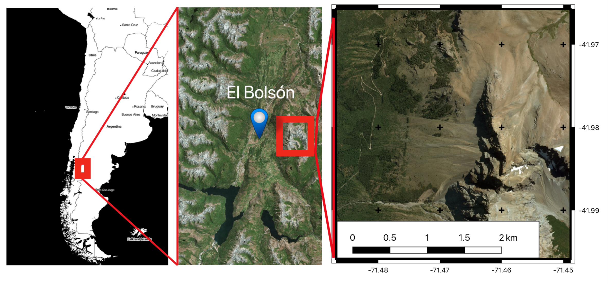
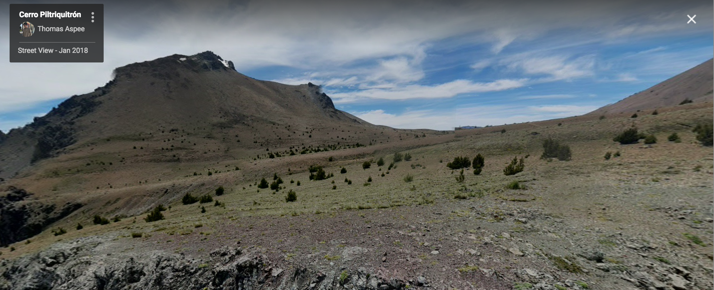

# Introduction 

- Biotic interactions between species are key drivers of many ecological process and can govern the organization of communities. 

- The functioning of ecosystem level processes in alpine environments can be especially susceptible to biodiversity shifts ( *e.g. range expansions creating novel species assemblages*). 

- The overall effects of interaction networks in the assembly of communities is not fully yet understood across trophic scales.

- Such impacts may greatly determine the ability of ecosystems to provide specific services to a large portion of the population around the world. 


# Study area


Non-native (*Pinus contorta*) pine invasions in alpine Patagonia. 

```{r, echo = F, fig.cap="Location of study area",fig.align="center", out.width = "80%"}

```


```{r, echo = F, fig.cap="Study site",fig.align="center", out.width = "70%"}


```

# Methods


- 45 plots of $2^2mts$ at 3 temporal treatments 

  - Belowground interation diversity
  - Plant diversity
  - abiotic and physical variables 
  - Arthropod diversity*

- Interaction meta-networks for each treatment (T)

- Network structural metrics (partial-metanetworks)

- Interaction richness relationships with abiotic soil conditions  

# Key Questions 


- Is there a congruent change on plant-microbial interactions across distinct trophic groups? 

- How distinct is the structure of interactions among trophic communities?  

- How to link up our findings to other environments?


```{r, echo = F, fig.cap="Network structure across trophic groups",fig.align="center", out.width = "80%"}
knitr::include_graphics("NetMetricChange.png")
```


# Future work


- Partitioning variance

- Finer taxonomic resolution 

- Functional aspects of interactions


```{r, echo = F,fig.align="center", out.width = "80%"}
knitr::include_graphics("ref.png")
```


